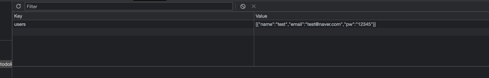
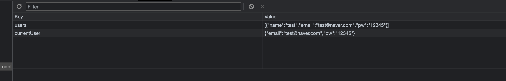
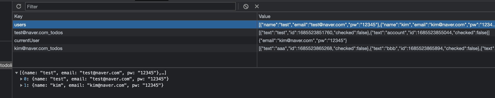

# TODO

### 로그인, 로그아웃

- [x] 비밀번호 유효성 검사

- [x] 이메일 유효성 검사

- [x] 새로고침해도 현재 사용자 정보 유지

- [x] 로그아웃

- [ ] 아이디 저장

- [ ] forgot password?

### 메인페이지

- [x] 시계

- [x] 날씨 API

- [x] 랜덤으로 명언 띄우기

- [x] todo list

- [x] todo list 진행률 바

- [x] localStorage에 사용자별로 todos 저장 (다른 사용자로 로그인하면 해당 사용자 정보 뜨도록)

- [x] 오늘 날짜

- [x] theme

- [ ] theme localstorage에 추가하기

- [ ] logo animation

- [ ] 반응형

 

---

# localStorage 설계

- users: 회원가입된 회원들의 정보를 저장해두는 곳
- currentUser: 로그인한 회원 (로그인하면 localStorage에 뜨고 로그아웃하면 사라짐)

users에 정보가 있으면 로그인이 돼서 currentUser에 정보가 저장되고, users에 정보가 없으면 로그인되지 않는다.

> 처음 로컬스토리지 화면. 회원가입한 회원이 없어 test계정만 저장된 상태.
> 

> test 계정으로 로그인
> 

> kim@naver.com 계정을 회원가입한 후, 로그인한 상태.  
> todo list의 정보는 회원별로 저장되도록 하였음.
> 

로그아웃을 하면, currentUser을 삭제하도록 해서, 로그아웃을 하지 않고 창을 닫았다가 다시 열면 로그아웃되지 않고 해당 계정의 로그인된 화면이 뜬다.

- 주의사항
  - localStorage는 해당 기기를 사용하는 모든 사용자가 접근할 수 있으므로, 회원정보같은 민감한 정보를 저장하지 않는다. (나는 아직 백엔드를 배우지 않았기 때문에 local storage를 사용한 것.)
  - currentUser의 value값을 회원 정보가 아닌 'done'으로 하는 방법도 있음.

 

---

# [회고] React의 필요성

## 1. 회고

이 프로젝트는 HTML, CSS, vanilla javascript로만 만들었다. 불편했던 점은 다음과 같다.

> 1.데이터와 화면의 일치 문제

단순한 기능만 포함한 사이트지만, 데이터와 화면을 일치시키기 위해 하나하나 신경써줘야 해서 불편하고, 실수할 가능성도 매우 높다고 판단했다.

내가 만든 투두리스트와는 비교도 안되게 복잡한 페이스북을 예로 들어보자. 페이스북에서 닉네임을 변경하면, 기존에 내가 작성했던 댓글이나 게시물에서는 이전 닉네임으로 뜨는 것과 같은 문제점(데이터와 화면의 불일치)이 발생했다.

- React는 single page application을 만드는, 즉 웹에서 모바일 앱같은 느낌이 나는 사이트를 만들 때 쓰인다. (따라서 간단한 웹페이지를 만들 때는 굳이 react를 쓸 필요가 없다.)

- web application에 대한 수요가 늘어났다. 기존의 웹페이지에 비해 데이터가 많다는 특징이 있음. ex) excel

- 데이터가 바뀌면 화면이 바뀌어야 하지만, 이걸 기존의 javascript, jquery로 구현하기에는 너무 복잡함

- React가 데이터와 화면의 일치 문제를 수월하게 해결해준다.

- React, Vue, Svelte, Preact, SolidJS 등의 라이브러리가 많지만, 우리나라에서는 React를 가장 많이 쓴다.

 

> 2.아쉬운 화면전환

화면 안에서 특정 부분만 새로고침하도록 하고싶은데, 방법을 몰라 window를 새로고침해서 해결했다. 그러다 보니 불필요한 부분까지 새로고침이 일어나 자연스러운 화면전환이 아쉬웠다.

 

## 2. React의 단점

- 검색 엔진 노출에 어려움이 있을 수 있다.

 

## 3. 앞으로의 계획

React의 필요성을 느꼈기 때문에 React 공부를 시작하되, 프론트엔드 개발자의 기본기는 역시 HTML, CSS, javascript이기 때문에 javascript 공부도 게을리하지 말자.
